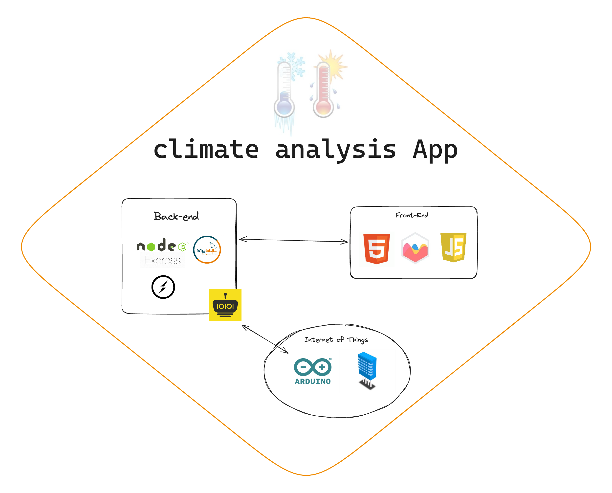

# Serial port with arduino

Esse projeto nasceu da ideia de compartilhar meus feitos. Criei um programa em Arduino utilizando um sensor DHT11 de temperatura e umidade, onde transmito através da porta serial e usando a biblioteca serialPort recebo os dados em um servidor NodeJS. O servidor usando a biblioteca socket.io envia os dados para o cliente, que por sua vez, utiliza a biblioteca chart.js para plotar os dados em um gráfico.

### fontes:
https://www.chartjs.org/docs/latest/

https://serialport.io/

https://www.chartjs.org/docs/latest/samples/line/segments.html

https://www.youtube.com/watch?v=EzLKYBT3FlE

#### cores:
https://materialui.co/colors/